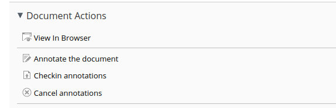
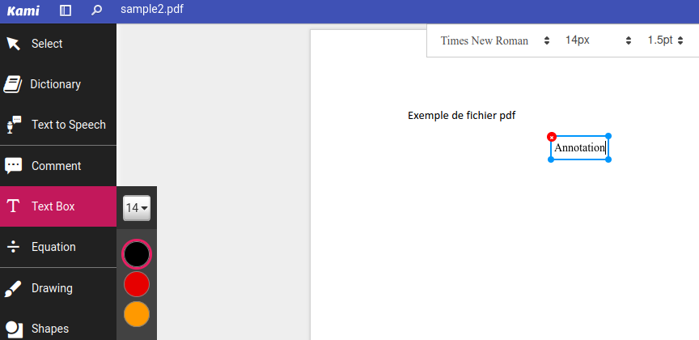
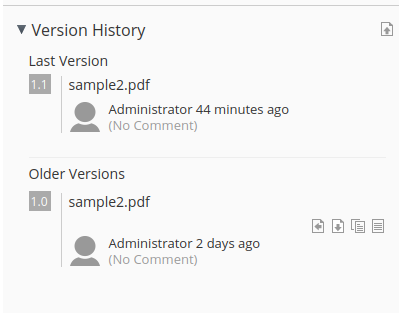
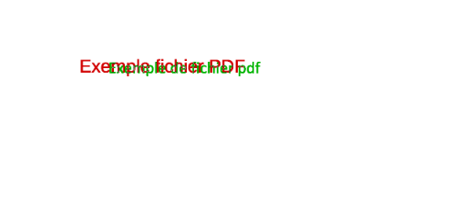
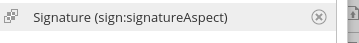
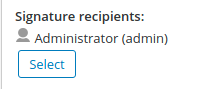
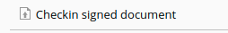

# beCPG Artworks

This addon provides three additional features to your Alfresco Content Service.

It can be use standalone or included in beCPG PLM.
beCPG is an open source Product Lifecycle Management (PLM) software designed to manage food, cosmetics and CPG products. It helps to accelerate innovation and reduce time-to-market while improving product quality.
https://www.becpg.fr/

# Annotation feature : provides an annotation tool for PDF files
  * In order to use the pdf file annotation feature, you need to provide a Kami license key by setting the property "beCPG.annotationAuthorization" under docker-compose.override.yml (sample file provided)
  
 

# Comparison feature : enables comparison button in document version view

This enables image and PDF comparison between 2 versions of a document.

  

# Document signature feature : provides a signing tool with DocuSign
  * In order to use the signature feature, you need to provide a DocuSign accountId and a valid access_token by setting the property "beCPG.signatureAuthorization" under docker-compose.override.yml (-DbeCPG.signatureAuthorization='accountId;access_token')

1) add the signature aspect on the document

2) add recipients

3) send for signature

3) wait for the recipients to sign the document (you will receive an email when it's done)

4) checkin the signed document

# Setup
 
 * download the two AMPs provided by the becpg-artworks release
 * install the two AMPs into your content service by running "java -jar /root/alfresco-mmt.jar install /root/amp/ webapps/alfresco -nobackup -directory -force" in your Dockerfile
 
 
# Build

This is an All-In-One (AIO) project for Alfresco SDK 4.2.

Run with `./run.sh build_start` or `./run.bat build_start` and verify that it

 * Runs Alfresco Content Service (ACS)
 * Runs Alfresco Share
 * Runs Alfresco Search Service (ASS)
 * Runs PostgreSQL database
 * Deploys the JAR assembled modules
 
All the services of the project are now run as docker containers. The run script offers the next tasks:

 * `build_start`. Build the whole project, recreate the ACS and Share docker images, start the dockerised environment composed by ACS, Share, ASS and 
 PostgreSQL and tail the logs of all the containers.
 * `build_start_it_supported`. Build the whole project including dependencies required for IT execution, recreate the ACS and Share docker images, start the 
 dockerised environment composed by ACS, Share, ASS and PostgreSQL and tail the logs of all the containers.
 * `start`. Start the dockerised environment without building the project and tail the logs of all the containers.
 * `stop`. Stop the dockerised environment.
 * `purge`. Stop the dockerised container and delete all the persistent data (docker volumes).
 * `tail`. Tail the logs of all the containers.
 * `reload_share`. Build the Share module, recreate the Share docker image and restart the Share container.
 * `reload_acs`. Build the ACS module, recreate the ACS docker image and restart the ACS container.
 * `build_test`. Build the whole project, recreate the ACS and Share docker images, start the dockerised environment, execute the integration tests from the
 `integration-tests` module and stop the environment.
 * `test`. Execute the integration tests (the environment must be already started).

