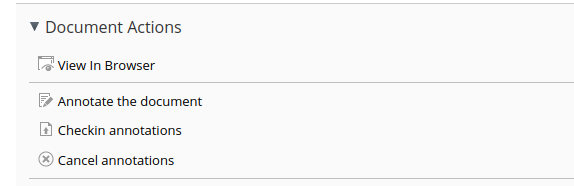
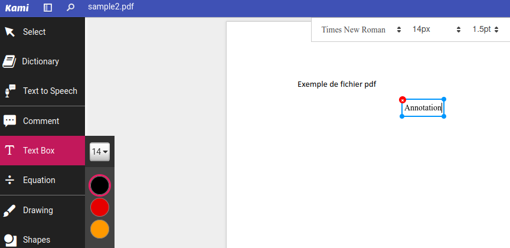
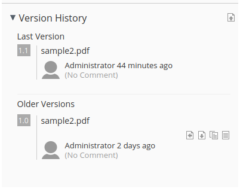
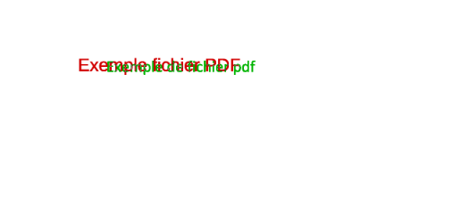
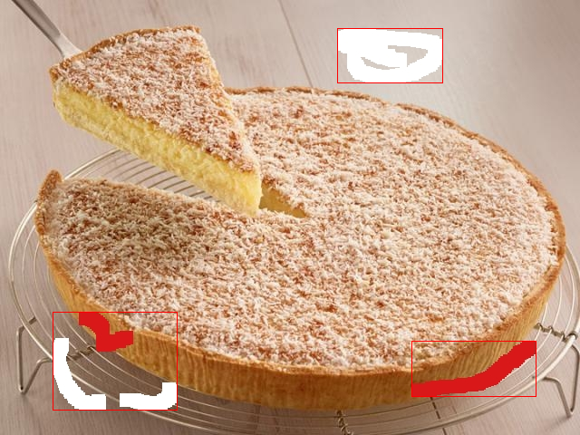
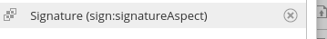
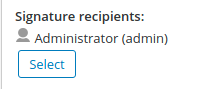
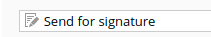
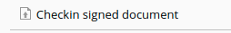

# Welcome to the beCPG Artworks Addon


<p align="center">
  </img>
</p>

## What is beCPG Artworks Addon?

This addon provides additional features to Alfresco Content Service.

It can be used standalone or included in beCPG PLM.

beCPG is an open source Product Lifecycle Management (PLM) software designed to manage food, cosmetics and CPG products.
 It helps to accelerate innovation and reduce time-to-market while improving product quality.
https://www.becpg.fr/


### Annotation feature

Annotation feature is provided with two implementations:
 * Standalone using  [PDFTron](https://www.pdftron.com/) proprietary library

 (TODO) list features and capture

 * Or external using [Kami](https://www.kamiapp.com/) annotation manager 

 


### Comparison feature


Enables comparison button in document version view

This enables image and PDF comparison between 2 versions of a document.

  

PDF text and image comparison feature are also provided with standalone PDFTron Viewer


### Digital signature feature

Digital signature is provided internally using [PDFTron](https://www.pdftron.com/) Library and [PDFBox](https://pdfbox.apache.org/) or externally using [Docusign](https://www.docusign.com/):  

1) add the signature aspect on the document


2) add recipients


3) send for signature


3) wait for the recipients to sign the document (you will receive an email when it's done)

4) check in the signed document


For details on how to use internal signatures refers to API


## Installation

### Prerequisites

-  Alfresco 7


### Build

This project uses Alfresco SDK 4.2. Refers to Alfresco SDK documentation to see how-to build and run project


### Install

 * Download the two **AMPs** provided by the **becpg-artworks** release

 * Install the two **AMPs** into your content service by running

   ```
    java -jar /root/alfresco-mmt.jar install /root/amp/ webapps/alfresco -nobackup -directory -force
   ```

   

For internal digital signature you have to install additional certificate in alfresco [keystore](https://docs.alfresco.com/content-services/latest/admin/security/#managealfkeystores):

Digital signature use the  alfresco **encryption.keystore.location** to store is certificate.

To install existing **pkcs12** certificates into default alfresco **keystore** use the following commands:

```bash
keytool -importkeystore \
        -deststorepass mp6yc0UD9e -destkeypass oKIWzVdEdA -destkeystore /usr/local/tomcat/shared/classes/alfresco/extension/keystore \
        -srckeystore my-cert.p12 -srcstoretype PKCS12  -deststoretype JCEKS -srcstorepass [p12-cert-password] \
        -alias [some-alias]
```


To create a new certificate for test purpose:

```bash
  keytool -genkeypair -alias [some-alias] -validity 365 -keyalg RSA -keysize 2048 -keypass oKIWzVdEdA -storetype JCEKS -keystore /usr/local/tomcat/shared/classes/alfresco/extension/keystore -storepass mp6yc0UD9e     
```


### Setup

Enable **DockSign** signature by providing API access token:

```properties
 beCPG.signatureAuthorization=accountId;access_token
```

Enable **Kami** external PDF annotation by providing API access token:

```properties
 beCPG.annotationAuthorization=token
```

Enable **PDFTron** internal PDF annotation by proving licence key:

```properties
 beCPG.annotationViewerLicenseKey=licenceKey
```

Enable internal digital signature with **PdfBox** (**PDFTron** annotation viewer is required) 

```properties
 beCPG.signature.reasonInfo=Digitally signed with beCPG
 beCPG.signature.tsaUrl=https://freetsa.org/tsr
 beCPG.signature.keystore.alias=[some-alias]
 beCPG.signature.keystore.password=[some-password]
```

To configure signature certificate use the new way of specifying the configuration in JVM system properties (Don't store password on properties files) :

```yml
JAVA_TOOL_OPTIONS: "
 -DbeCPG.signature.keystore.alias=[some-alias]
 -DbeCPG.signature.keystore.password=[some-password]
"
```

Note: If left empty or not provided, features are not enabled.

Internal signature support is best integrated with beCPG PLM. If you want to use it out of box beCPG provides several JavaScript Helpers. 


## API

**beCPG Arworks** expose some JavaScript API function in order to use digital signature under the **bSign** root object

| Method                                            | Description                                                  |
| ------------------------------------------------- | ------------------------------------------------------------ |
| prepareForSignature(document, recipients, params) | document is the ScriptNode of the PDF document you want to sign, recipients is an array of ScriptNode representing the current recipients, params is an optional parameter which is an array of strings, the values change the signature positioning, size, and string anchors for the signature |
| signDocument(document)                            | Digitally sign the document for the prepared recipients      |
| getSignatureView(document, userName,  task)       | Return signature viewer url                                  |


Parameters :

The signature feature is designed so that each page of the document will contain a signature field, either a "final signature" field, or a "initials" signature. You can define in which page you want to see the final signature, among other things.

The **params** of the **prepareForSignature** method have default values if nothing is set. Here is the default params structure :

```javascript
bSign.prepareForSignature(document, recipients, "last", "100,50,1,150,300,300", "signature,2,0", "50,25,3,30,150,150", "Page,0,2")
```

 * **last** : defines the page number of the final signature. It can be a number ("1", "14", ...) or a number from the end ("last", "last-2", ...)
 * **100,50,1,150,300,300** : defines the signature field dimensions (width,height,direction(1=right,2=left,3=up,4=down),gap,rightMargin,bottomMargin). Direction is the direction of the multiple fields on each page (if there are multiple recipients). The margins are here to positionate the first field in case of a non-matching keyword
 * **signature,2,0** : defines the signature field anchor information (keyWord,xposition(0=left,1=middle,2=right),yposition(0=bottom,1=middle,2=top))
 * "**50,25,3,30,150,150**" : defines the initials field dimensions (width,height,direction(1=right,2=left,3=up,4=down),gap,rightMargin,bottomMargin)
 * **Page,0,2** : defines the initials field anchor information (keyWord,xposition(0=left,1=middle,2=right),yposition(0=bottom,1=middle,2=top))


### Use case

  You can call the beCPG Signature API inside your scripts. Here is a example of workflow using scripts :

  1. Upload a PDF document to ACS
  2. Add the signature aspect to it, with some "sign:recipients" associations which are the recipients (alfresco accounts)
  3. Call the "prepareForSignature" method
    ` bSign.prepareForSignature(document, recipients, params) ` 
the current recipients (they must belong to the recipients defined earlier. The signature preparation can be done for each recipient or for all recipients at once, depending on your process), 
  4. Call the "getSignatureView" method ` bSign.getSignatureView(document, null, null) ` which will return a URL (it must be prefixed with "https://HOST:PORT/share/page/context/mine/") example : http://localhost:8180/share/page/context/mine/artworks-viewer?nodeRef=workspace://SpacesStore/eba3017f-176b-4316-aafd-c2037c477cae&mode=sign&returnUrl=/share/page/context/mine/document-details?nodeRef=workspace://SpacesStore/38a2e156-73c0-47d9-8efd-24c84782c084
  5. Once you enter the viewer, you can see the annotations that need to be signed. Please sign all the annotations before Saving the document
  6. Once the document is saved with the viewer, you need to complete the signature by calling the method "signDocument"
    ` bSign.signDocument(document) ` which will digitally sign the document for the prepared recipients

Example :

```javascript
var document = search.findNode("workspace://SpacesStore/38a2e156-73c0-47d9-8efd-24c84782c084");
var recipient1 = search.findNode("workspace://SpacesStore/16c4ef69-aab4-4017-9d84-d3e1b526086f");
var recipient2 = search.findNode("workspace://SpacesStore/b4273aa7-b66c-4cfe-81c0-02f95a26d7af");

// create the recipients associations
document.createAssociation(recipient1, "sign:recipients");
document.createAssociation(recipient2, "sign:recipients");

// prepare signature of recipient1
var preparedRecipient = [];
preparedRecipient.push(recipient1);
bSign.prepareForSignature(document, preparedRecipient);

// get the signature view for recipient1
var url = bSign.getSignatureView(document,null,null);
```

Here the recipient1 must sign the document with the viewer and save it.

```javascript
// after recipient1 signed the document with the viewer : sign the document digitally for recipient1
bSign.signDocument(document);

// prepare signature of recipient2
var preparedRecipient = [];
preparedRecipient.push(recipient2);
bSign.prepareForSignature(document, preparedRecipient);

// get the signature view for recipient2
var url = bSign.getSignatureView(document,null,null);
```

Here the recipient2 must sign the document with the viewer and save it.

```javascript
// after recipient2 signed the document with the viewer : sign the document digitally for recipient2
bSign.signDocument(document);
```


