# beCPG Artworks – Annotation, Comparison and Digital Signature for Alfresco

[](https://www.gnu.org/licenses/lgpl-3.0)
[](https://www.oracle.com/java/)
[](https://maven.apache.org/)
[](https://github.com/becpg/becpg-artworks/issues)
[](https://github.com/becpg/becpg-artworks/stargazers)
[](https://docs.becpg.fr)
[](http://www.becpg.net)

---

## 🚀 What is beCPG Artworks?

**beCPG Artworks** is an addon for **Alfresco Content Services** that provides advanced document handling features. 
It can be used as a standalone Alfresco extension or seamlessly integrated into **beCPG PLM**.

It empowers users to annotate, compare, and digitally sign documents directly within the Alfresco Share interface.

👉 [**Request a Live Demo**](https://www.becpg.net/community/) | [**Contact Us**](https://www.becpg.net/contact-us/)

---

## 📸 Screenshots

### 🖋️ Annotation Feature
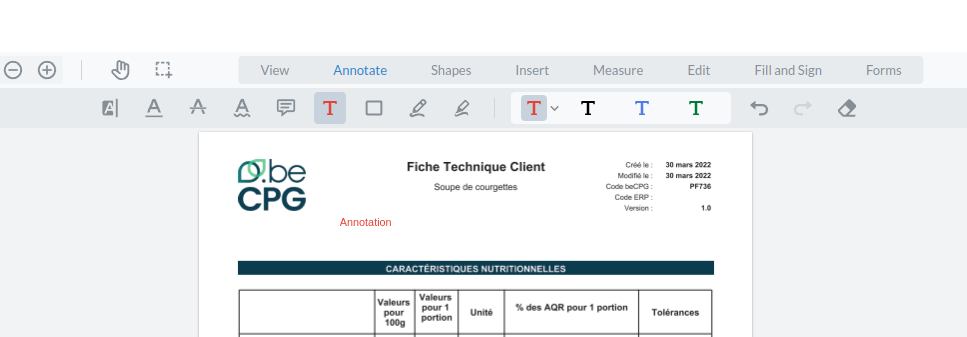
*Collaborative annotation on PDF documents*

<p align="center">
  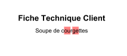
  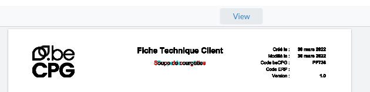
  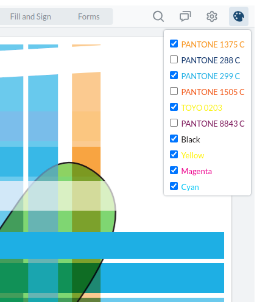
</p>
<p align="center">
  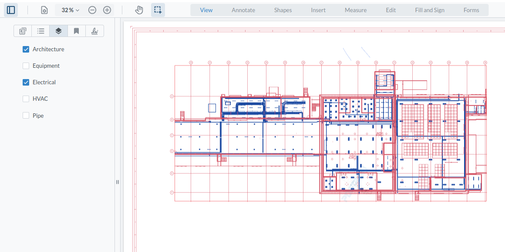
  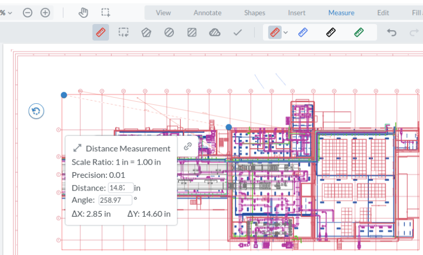
</p>

### 🔍 Comparison Feature
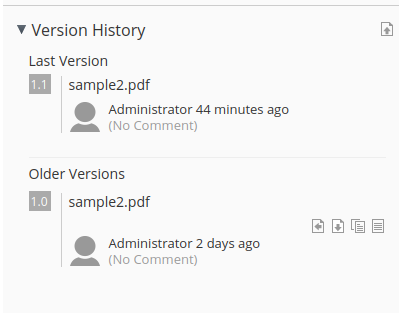
*Side-by-side comparison of document versions*

<p align="center">
  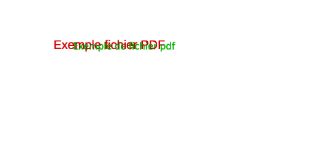
  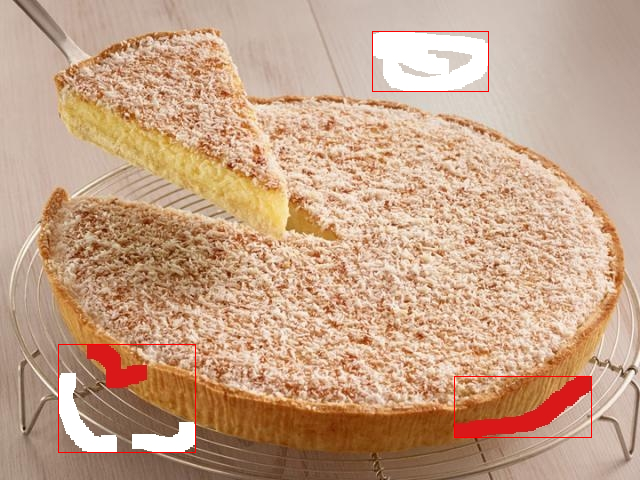
</p>

### ✍️ Digital Signature Feature
<p align="center">
  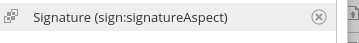
  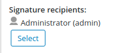
  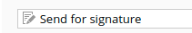
  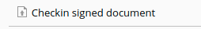
</p>
*Step-by-step digital signature process*

---

## 💡 Key Features

### 🖋️ Annotation
Annotation feature is provided with two implementations:
* **Standalone using [PDFTron](https://www.pdftron.com/)**:
  * Add annotations, track text changes, visualize image changes.
  * Extract colors, layers, and perform measurements.
* **External using [Kami](https://www.kamiapp.com/)** annotation manager.

### 🔍 Comparison
Enables image and PDF comparison between 2 versions of a document.
* PDF text and image comparison are provided with standalone PDFTron Viewer.
* Available directly from the document version view.

### ✍️ Digital Signature
Internal signature using **PDFTron** and **PDFBox**, or external via **DocuSign** or **YouSign**.
1. Add signature aspect to the document.
2. Manage recipients and send for signature.
3. Automated email notifications and signed document check-in.

---

## 🛠️ Installation

### Prerequisites
- Alfresco Community 25.3+
- Java 17+
- Maven 3.3.0+

### Build
This project uses Alfresco SDK 4.2.
```bash
./run.sh build_start
```

### Install
1. Download the two **AMPs** (platform & share) from the [releases](https://github.com/becpg/becpg-artworks/releases).
2. Install them into your Alfresco instance:
   ```bash
   java -jar alfresco-mmt.jar install becpg-artworks-platform.amp webapps/alfresco.war -force
   java -jar alfresco-mmt.jar install becpg-artworks-share.amp webapps/share.war -force
   ```

---

## ⚙️ Configuration

Refer to the [Documentation](https://docs.becpg.fr) for detailed setup of:
- **DocuSign / Kami / PDFTron** licenses and tokens.
- **Keystore** configuration for internal digital signatures.
- **JVM System Properties** for secure password management.

---

## 🤝 Community & Contributing

* [Contributing Guidelines](CONTRIBUTING.md)
* [Code of Conduct](CODE_OF_CONDUCT.md)
* [Security Policy](SECURITY.md)
* [AI Assistant Guidelines](AGENTS.md)

---

## 📩 Contact

Interested in trying **beCPG PLM** or this addon?

* 🌐 [Website](https://www.becpg.net)
* 📖 [Documentation](https://docs.becpg.fr)
* 🎮 [Live Demo](https://www.becpg.net/community/)
* ✉️ [Contact Us](https://www.becpg.net/contact-us/)

---
⚡ **beCPG Artworks – Enhance your document lifecycle with annotation and digital signatures.**
